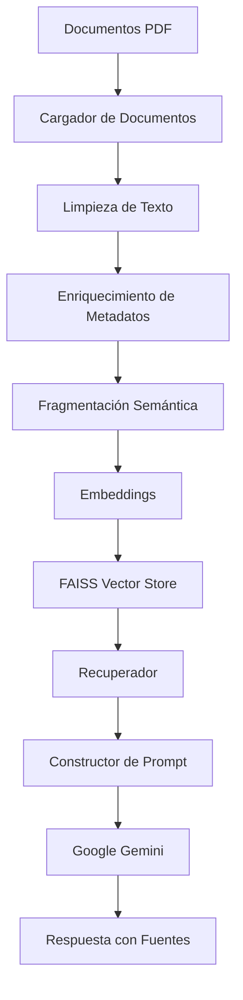
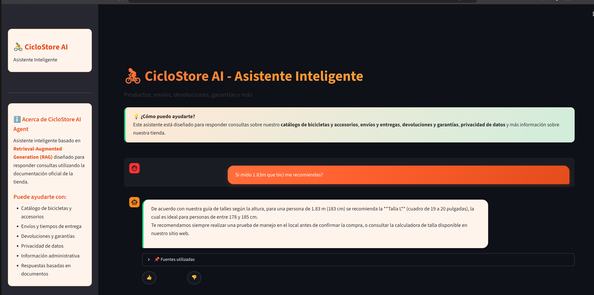

# 🚴 CicloStore AI Agent

# Plataforma de Recuperación Aumentada con Generación (RAG)

### Asistente inteligente para e-commerce de bicicletas construido con LangChain, FAISS y Oracle Cloud Infrastructure.


---

# 📖 Visión General

CicloStore AI Agent es una **plataforma de Recuperación Aumentada con Generación (RAG) lista para producción**, diseñada para proporcionar respuestas confiables y trazables a partir de la documentación comercial y administrativa de una tienda de bicicletas.

En lugar de depender del conocimiento interno del modelo de lenguaje, el sistema recupera los fragmentos de documentos más relevantes desde una base de datos vectorial y genera respuestas exclusivamente a partir de información institucional verificada (catálogo de productos, envíos, devoluciones, garantías y privacidad).

Cada respuesta incluye su fuente correspondiente, permitiendo a los usuarios validar el origen de la información.

---

# ✨ Características Principales

- 📄 Ingesta automática de documentos PDF
- 🧹 Pipeline inteligente de limpieza de documentos
- 🏷 Enriquecimiento de metadatos por documento
- ✂️ Generación de fragmentos semánticos
- 🧠 Embeddings de Google Gemini (sin dependencias pesadas locales)
- 🔍 Base de datos vectorial FAISS
- 📚 Recuperación consciente del contexto (MMR)
- 🤖 Integración con Google Gemini
- 💬 Interfaz interactiva con Streamlit
- 📌 Citación de fuentes (documento + página)
- ☁️ Despliegue en Oracle Cloud Infrastructure
- 🐳 Arquitectura preparada para Docker
- 🔐 Autenticación segura usando Instance Principals de OCI
- 📦 Vector Store persistente almacenado en OCI Object Storage

---

# 🏛 Arquitectura del Sistema

El sistema sigue una arquitectura modular de Recuperación Aumentada con Generación.

```text
                       Usuario
                         │
                         ▼
                 Interfaz Streamlit
                         │
                         ▼
                  Servicio de Consultas
                         │
                         ▼
                   Pipeline RAG
                         │
        ┌────────────────┴─────────────────┐
        ▼                                  ▼
 Recuperador                        Constructor de Prompt
        │                                  │
        ▼                                  ▼
FAISS Vector Store                 Google Gemini
        │                                  │
        └────────────────┬─────────────────┘
                         ▼
              Respuesta con Fuentes
```

---

# 🔄 Pipeline de Recuperación Aumentada con Generación



---

# 🚀 Arquitectura de Producción (Oracle Cloud Infrastructure)

```text
                    Internet
                        │
                        ▼
                  Dominio DuckDNS
                        │
                        ▼
             OCI Load Balancer (HTTPS)
                        │
                        ▼
                  Nginx Reverse Proxy
                        │
                        ▼
              Contenedor Docker (Streamlit)
                        │
            ┌───────────┴────────────┐
            ▼                        ▼
   OCI Object Storage         Google Gemini API
            │
            ▼
     Índice FAISS + Documentos
```

---

# 🎯 Objetivos de Diseño

CicloStore AI Agent fue construido siguiendo principios modernos de ingeniería de software.

- Arquitectura modular
- Separación de responsabilidades
- Despliegue listo para producción
- Respuestas de IA trazables
- Infraestructura nativa en la nube
- Gestión segura de secretos
- Código mantenible
- Ingesta de documentos escalable
- Pipeline de procesamiento extensible

---

# 📂 Estructura del Proyecto

El proyecto sigue una arquitectura modular basada en el principio de **Separación de Responsabilidades (SoC)**, donde cada módulo tiene una única responsabilidad.

```text
bike-shop-ai-agent/
│
├── app/
│   ├── chains/            # Pipeline RAG
│   ├── config/            # Configuración de la aplicación
│   ├── core/               # Excepciones y logging
│   ├── loaders/            # Cargadores de documentos
│   ├── models/             # Integraciones LLM
│   ├── processing/         # Limpieza, metadatos, fragmentación
│   ├── prompts/            # Plantillas de prompts
│   ├── retrievers/         # Búsqueda semántica
│   ├── services/           # Lógica de negocio
│   ├── ui/                 # Interfaz Streamlit
│   └── vectorstores/       # Implementación FAISS
│
├── assets/                 # Imágenes y documentación
│
├── data/
│   └── documentos/
│       ├── productos/
│       ├── envios/
│       └── politicas/
│
├── vector_db/
│   └── faiss_index/
│
├── Dockerfile
├── requirements.txt
├── streamlit_app.py
└── README.md
```

---

# ⚙️ Tecnologías Utilizadas
## Lenguaje de Programación
- Python 3.13

---

## IA & LLM

- LangChain
- Google Gemini (modelo de chat y modelo de embeddings)

---

## Recuperación
- FAISS
- Gemini Embeddings (`gemini-embedding-001`)

---

## Procesamiento de Documentos
- PyPDF
- LangChain Document Loaders
- LangChain Text Splitters (tokenizador `tiktoken`)

---

## Interfaz de Usuario
- Streamlit

---

## Cloud
- Oracle Cloud Infrastructure (OCI)

Componentes utilizados:
- OCI Compute
- OCI Object Storage
- OCI Load Balancer
- OCI IAM
- OCI Instance Principals

---

## DevOps
- Docker
- Git
- GitHub

---

# 📄 Organización de documentos

```text
data/documentos/

├── productos/
│       catalogo_bicicletas_y_accesorios.pdf
│
├── envios/
│       faq_envios_y_entregas.pdf
│
└── politicas/
        politica_devoluciones_y_garantias.pdf
        politica_privacidad_clientes.pdf
```

Esta estructura permite que la canalización de ingesta infiera automáticamente las categorías de los documentos sin necesidad de configuración adicional. El nombre de la subcarpeta se usa como `category` en los metadatos de cada fragmento.

---

# 🧹 Pipeline de Procesamiento de Documentos

Cada documento subido pasa por un pipeline de preprocesamiento de múltiples etapas antes de ser indexado.

## 1. Carga de Documentos

Los documentos se cargan de forma recursiva utilizando:

- DirectoryLoader
- PyPDFLoader

---

## 2. Limpieza de Texto

El pipeline de limpieza elimina el ruido de extracción comúnmente encontrado en documentos PDF (encabezados repetidos, pies de página, números de página, espacios adicionales, líneas rotas, artefactos de extracción corruptos).

---

## 3. Enriquecimiento de Metadatos

Cada documento recibe metadatos adicionales utilizados durante la recuperación y la atribución de fuentes.

| Campo | Descripción |
|------|-------------|
| document_id | Identificador UUID |
| category | productos, envios, politicas |
| title | Título derivado del nombre del archivo |
| filename | Nombre original del archivo PDF |
| indexed_at | Fecha de indexación |

---

# ✂️ Fragmentación Semántica

| Parámetro | Valor |
|------------|------:|
| Tamaño del Fragmento | 1250 tokens |
| Superposición | 150 tokens |
| Tokenizador | tiktoken (`cl100k_base`) |

---

# 🧠 Embeddings

El proyecto utiliza el modelo de embeddings de Google Gemini (vía API, sin dependencias pesadas locales como PyTorch):

```
models/gemini-embedding-001
```

Esta decisión evita instalar PyTorch/Transformers/Sentence-Transformers, lo que reduce drásticamente el tamaño de la imagen Docker y el tiempo de arranque en entornos con recursos limitados (por ejemplo, instancias gratuitas de OCI Compute).

---

# 🔎 Búsqueda Vectorial

La búsqueda semántica está impulsada por **FAISS**, usando Maximal Marginal Relevance (MMR) para reducir contexto redundante y maximizar cobertura de información.

---

# 💬 Generación de Respuestas

El asistente tiene instrucciones explícitas para:

- Responder únicamente a partir del contexto recuperado del catálogo, envíos y políticas de la tienda.
- Evitar alucinaciones (no inventar precios, plazos ni condiciones).
- Indicar cuando la información no está disponible.
- Preservar la atribución de fuentes.

---

# 📌 Atribución de Fuentes

Ejemplo:

```text
Las devoluciones deben solicitarse dentro de los 30 días corridos desde la recepción del producto.

Fuentes:

• Politica Devoluciones Y Garantias
  Category: politicas
  Page: 1
```

---

# 💬 Ejemplos de Preguntas y Respuestas

A continuación se muestran ejemplos reales de preguntas realizadas al agente y las respuestas generadas, obtenidas a partir de los documentos incluidos en `data/documentos/`.

## Ejemplo 1 — Política de devoluciones

**Pregunta:**
```
¿Cuántos días tengo para devolver una bicicleta?
```

**Respuesta del agente:**
```
Dispone de un plazo de 30 días corridos desde la fecha de recepción del producto para
solicitar una devolución o cambio.

Para el caso de las bicicletas, estas deben cumplir con las siguientes condiciones:
- No deben presentar signos de rodado (como barro, rayones de uso, o ajustes de frenos
  o cambios realizados por el cliente).
- Deben encontrarse en perfecto estado, sin uso, con el embalaje original y todos sus
  accesorios, manuales y etiquetas.
```
**Fuentes:** `politica_devoluciones_y_garantias.pdf` (categoría: politicas, páginas 1-2), `catalogo_bicicletas_y_accesorios.pdf` (categoría: productos).

---

## Ejemplo 2 — Recomendación de producto según peso y altura

**Pregunta:**
```
Peso 105 kg y mido 1.80m, ¿qué bicicleta de montaña me recomendás?
```

**Respuesta del agente:**
```
De acuerdo con la información de nuestro catálogo, para tu peso de 105 kg, las opciones
recomendadas en bicicletas de montaña (MTB) son las siguientes, ya que se encuentran
dentro de los límites de carga recomendados:

1. MTB Hardtail (cuadro de aluminio): soporta un límite de peso de hasta 110 kg.
   Precios orientativos: gama entrada 600.000 a 900.000 pesos, gama media 900.000 a
   1.500.000 pesos, gama alta 1.500.000 a 2.500.000 pesos.

2. MTB Doble Suspensión: soporta un límite de peso de hasta 120 kg.
   Precios orientativos: gama entrada 1.800.000 a 2.500.000 pesos, gama media
   2.500.000 a 4.000.000 pesos, gama alta 4.000.000 a 7.000.000 pesos.

Nota: si con la carga adicional superás el límite recomendado, te sugerimos consultar
por los modelos de cuadro reforzado (línea Heavy Duty) o por modelos eléctricos.
```
**Fuentes:** `catalogo_bicicletas_y_accesorios.pdf` (categoría: productos).

---

## Ejemplo 3 — Precio de un producto

**Pregunta:**
```
¿Cuánto cuesta una bicicleta eléctrica?
```

**Respuesta del agente:**
```
De acuerdo con nuestro catálogo, los precios orientativos para una bicicleta eléctrica
(e-bike) varían según su gama:

- Gama entrada: 2.500.000 a 3.500.000 pesos.
- Gama media: 3.500.000 a 5.500.000 pesos.
- Gama alta: 5.500.000 a 9.000.000 pesos.
```
**Fuentes:** `catalogo_bicicletas_y_accesorios.pdf` (categoría: productos).

---

## Otras preguntas que el agente puede responder

- ¿Cuáles son los tiempos de entrega para el área metropolitana?
- ¿El envío de una bicicleta completa tiene costo adicional?
- ¿Qué cubre la garantía de fábrica de una e-bike?
- ¿Qué datos personales recopila la tienda y para qué los usa?
- ¿Puedo retirar mi pedido en sucursal?
- ¿Qué talla de cuadro me corresponde si mido 1.75m?

Si la pregunta no puede responderse con la información de los documentos indexados, el agente responde explícitamente: *"No encontré información en los documentos."* — evitando inventar datos que no estén en las fuentes oficiales.

---

# 🔐 Seguridad

La información sensible nunca se almacena en el código fuente. El proyecto utiliza variables de entorno, OCI Instance Principals, políticas de OCI IAM y permisos de OCI Object Storage.

---

# 🚀 Primeros Pasos

## Requisitos Previos

- Python 3.13+
- Git
- Docker (opcional, recomendado)
- Cuenta de Oracle Cloud Infrastructure (para sincronizar documentos e índice)
- Clave API de Google Gemini

---

# 📦 Crea un entorno virtual

```bash
python -m venv .venv
```

### Windows

```bash
.venv\Scripts\activate
```

### Linux / macOS

```bash
source .venv/bin/activate
```

---

# 📚 Instalar dependencias

```bash
pip install --upgrade pip
pip install -r requirements.txt
```

---

# ⚙️ Variables de entorno

Crea un archivo `.env` en la raíz del proyecto.

```env
# ======================================
# Google Gemini
# ======================================

GEMINI_API_KEY=your_api_key

# ======================================
# LangSmith (Optional)
# ======================================

LANGSMITH_API_KEY=

LANGSMITH_TRACING=false

# ======================================
# OCI Object Storage
# ======================================

OCI_NAMESPACE=your_namespace

OCI_BUCKET_NAME=bike-shop-ai-agent

OCI_REGION=sa-santiago-1
```

---

# 📄 Preparar los Documentos

Este repositorio ya incluye 4 documentos PDF de ejemplo en `data/documentos/` (catálogo de productos, envíos, devoluciones/garantías y privacidad) para que puedas probar el sistema de inmediato. Podés reemplazarlos o agregar los tuyos respetando la estructura de carpetas:

```text
data/documentos/

productos/
    catalogo_bicicletas_y_accesorios.pdf

envios/
    faq_envios_y_entregas.pdf

politicas/
    politica_devoluciones_y_garantias.pdf
    politica_privacidad_clientes.pdf
```

---

# 🧠 Construir el Índice Vectorial

El pipeline de ingestión (`app/services/ingestion_service.py`) realiza:

- Sincronizar documentos desde OCI Object Storage.
- Cargar documentos locales.
- Limpiar texto extraído.
- Enriquecer metadatos.
- Generar fragmentos semánticos.
- Crear embeddings.
- Construir índice FAISS.
- Publicar el índice en OCI Object Storage.

Podés ejecutar la ingesta con un pequeño script, por ejemplo:

```bash
python -c "from app.services.ingestion_service import construir_vectorstore; construir_vectorstore()"
```

Archivos generados localmente:

```text
vector_db/
└── faiss_index/
      index.faiss
      index.pkl
```

En producción, estos archivos se sincronizan con OCI Object Storage.

---

# 🔧 Configuración Local para Pruebas con OCI

## 📁 Crear la Carpeta `.oci`

```bash
# En Linux / Mac
mkdir -p ~/.oci

# En Windows (PowerShell)
mkdir $env:USERPROFILE\.oci
```

## 📄 Crear el Archivo config

```text
[DEFAULT]
user=TU_USER_OCID
fingerprint=TU_FINGERPRINT
tenancy=TU_TENANCY_OCID
region=TU_REGION
key_file=~/.oci/TU_CLAVE.pem
```

| Campo | Descripción | Dónde obtenerlo |
|-------|-------------|-----------------|
| `TU_USER_OCID` | OCID del usuario IAM | Consola OCI → Identity → Users → OCID del usuario |
| `TU_FINGERPRINT` | Huella de la clave API | Consola OCI → Identity → Users → API Keys → Fingerprint |
| `TU_TENANCY_OCID` | OCID de la tenencia | Consola OCI → Identity → Tenancy → OCID |
| `TU_REGION` | Región de OCI | Ejemplo: `sa-santiago-1`, `us-ashburn-1`, etc. |
| `TU_CLAVE.pem` | Nombre de tu archivo de clave privada | Debe coincidir con el archivo `.pem` que tengas |

## 🔐 Permisos (Linux / Mac)

```bash
chmod 600 ~/.oci/TU_CLAVE.pem
```

✅ Verificación:

```bash
python -c "import oci; config=oci.config.from_file(); print('✅ Configuración OCI cargada correctamente')"
```

---

# ▶️ Ejecutar la Aplicación

```bash
streamlit run streamlit_app.py
```

La aplicación estará disponible en:

```text
http://localhost:8501
```

---

# 🐳 Docker

## Construir la Imagen

```bash
docker build -t bike-shop-ai-agent:1.0 .
```

## Ejecutar el Contenedor

```bash
docker run -d \
--name bike-shop-ai-agent \
-p 8501:8501 \
--env-file .env \
bike-shop-ai-agent:1.0
```

## Ver Logs

```bash
docker logs -f bike-shop-ai-agent
```

---

# ☁️ Despliegue en Oracle Cloud Infrastructure

## Componentes de Infraestructura

| Servicio | Propósito |
|----------|-----------|
| OCI Compute | Host de la aplicación |
| Docker | Entorno de ejecución de contenedores |
| OCI Object Storage | Repositorio de documentos e índice FAISS |
| OCI IAM | Gestión de accesos |
| Instance Principals | Autenticación segura |
| Nginx | Proxy inverso |
| OCI Load Balancer | Endpoint público HTTPS |
| DuckDNS | DNS público |

---

# 🌐 Evidencia del Deploy

La aplicación está desplegada y funcionando en una instancia de **OCI Compute** (`VM.Standard.E2.1.Micro`, Ubuntu 24.04), corriendo dentro de un contenedor Docker, con red pública configurada (VCN, Internet Gateway, Subnet pública) y autenticación a OCI Object Storage mediante **Instance Principals** (sin claves copiadas al servidor).

**URL pública:**

```
http://136.248.88.214:8501
```

**Captura de la aplicación en funcionamiento**, respondiendo una consulta real sobre recomendación de talle según altura:



---

# 📦 Estructura de Object Storage

```text
bike-shop-ai-agent/

├── documentos/
│   ├── productos/
│   ├── envios/
│   └── politicas/
│
└── vectorstore/
      index.faiss
      index.pkl
```

La aplicación descarga automáticamente el índice FAISS durante el inicio si no está disponible localmente.

---

# 📈 Escalabilidad

- Oracle Kubernetes Engine (OKE)
- Autonomous Database Vector Search
- Múltiples instancias de Compute
- OCI DevOps CI/CD
- Sincronización automática de documentos
- Caché con Redis
- Autenticación (SSO / OAuth)

---

# 📝 Logging

La aplicación utiliza **logging centralizado**, disponible vía `docker logs bike-shop-ai-agent` o `journalctl` según la estrategia de despliegue.

---

# 🛣️ Roadmap

## ✅ Versión 1.0

- Arquitectura RAG modular
- Ingesta de documentos PDF
- Pipeline de limpieza de texto
- Enriquecimiento de metadatos
- Fragmentación semántica (chunking)
- Embeddings de Google Gemini
- FAISS Vector Store
- Integración con Google Gemini
- Atribución de fuentes
- Interfaz con Streamlit
- Despliegue con Docker
- Integración con OCI Object Storage

## 🚀 Versión 2.0 (planificado)

- Backend con FastAPI
- Carrito de compras conectado al asistente
- Historial de conversaciones persistente
- API REST
- Respuestas en streaming
- Integración con OCI Vault

---

# 🤝 Cómo Contribuir

1. Haz un fork del repositorio.
2. Crea una rama para tu funcionalidad: `git checkout -b feature/my-feature`
3. Confirma tus cambios: `git commit -m "feat: add new feature"`
4. Sube tu rama: `git push origin feature/my-feature`
5. Abre un Pull Request.

---

## 📝 Licencia

Este proyecto está bajo la Licencia MIT. Para más detalles, consulta el archivo [LICENSE](LICENSE).

---

# 🙏 Agradecimientos

Este proyecto fue posible gracias al ecosistema de código abierto: LangChain, Google Gemini, Meta FAISS, Streamlit, Oracle Cloud Infrastructure y la comunidad de Python.

Arquitectura basada en el proyecto [Clinic AI Agent](https://github.com/solanomillo/clinic-ai-agent) de Julio Solano, adaptada a un caso de uso de e-commerce de bicicletas.

---

<div align="center">

**CicloStore AI Agent**

Plataforma de Generación Aumentada por Recuperación para e-commerce.

Construido con Python, LangChain y Oracle Cloud Infrastructure.

</div>
